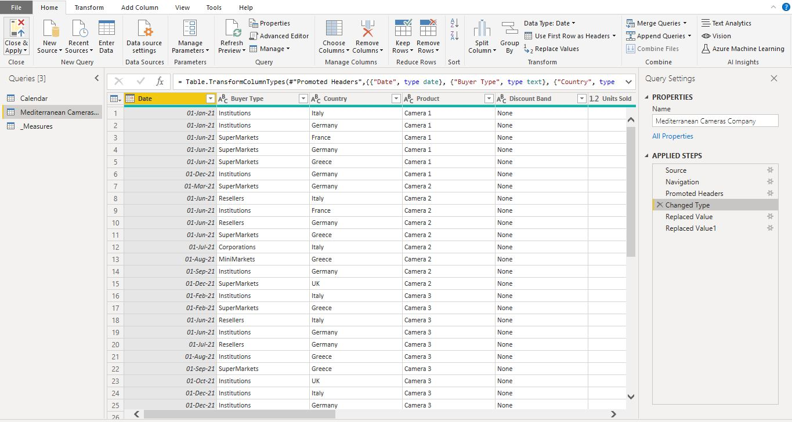
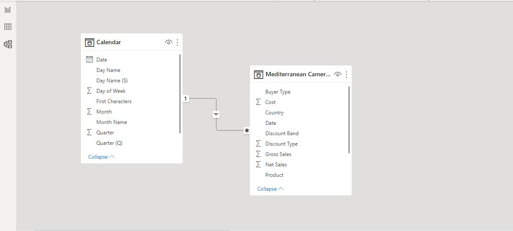
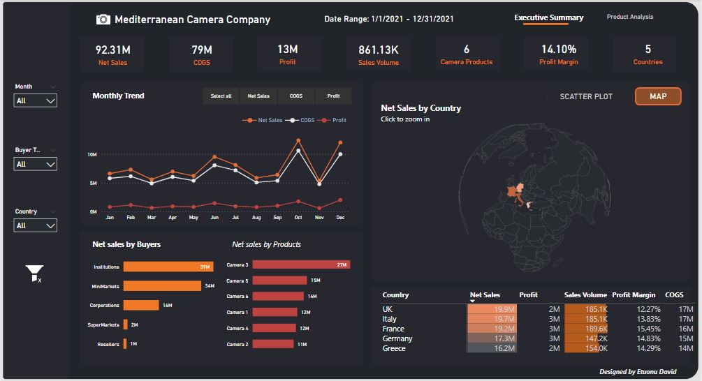
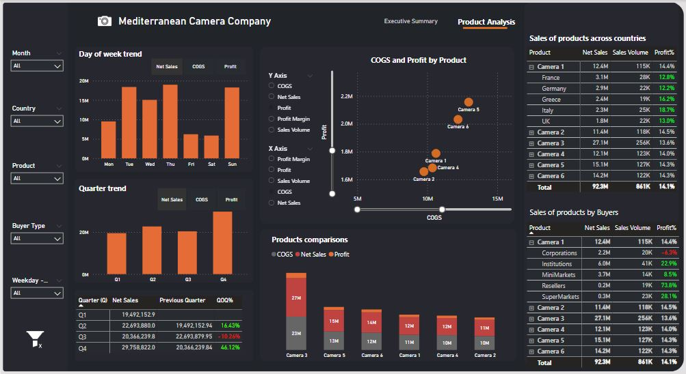

# Mediteraanean Camera Company Dashboard with PowerBI

## Introduction
Mediterranean camera company is a company that sells different cameras across different countries and states.
This is a two paged dashboard for the monitoring of the sales of the camera products across the different countries in which it sells in.
This report is built in Power BI with the background and images imported from Microsoft Powerpoint

This is a dataset from the FP20 Analytics Challenge 2.

## Skills demonstrated
- Dax
- Drillthrough
- Tooltip
- Bookmarks
- Field Parameterization
- Page Navigation
- Shape Map Visualization
- Filters and Slicers

## Problem Statement
The Mediterranean Camera Company’s CFO Ms. Toni Hewlett is expecting a report with no more than 2 pages with a horizontal navigation menu. This is an (EDA) Exploratory Data Analysis and product
specifications have been masked.
- Page 1 should be an Executive overview of the Company Sales performance YTD report.
- Page 2 should be dedicated to a Products Data Analysis and Time Intelligence report. Any trends/seasonality for any of the Products and or Countries of sales. Does any product sell more over weekends?

## Data Sourcing
There is 1 Dataset, compose of 3 tabs in blue for English Language speakers and 3 tabs in green for Spanish Language speakers. Both datasets contain the same information.
For the English Language speakers the 3 tabs are as follows:
- Mediterranean Cameras Company sheet : This consists of all the sales data and has 13 columns and 526 rows
- Calendar sheet: This is the date table for this data. It has 11 columns and 365 rows. It ranges from January to December of 2021.
- Data Dictionary: This sheet contains information about the Sales sheet.

This dataset is available in the repository for download.

## Data Transformation and Cleaning
- Converting to appropriate datatye: The columns were converted to the appropriate datatype such as Date column was conveted to Date Datatype.
- replacing "United Kingdom" to "UK" in the Country column, this is to ensure that the label fits into the visuals and prevent overflowing of text.

## Modelling.
The Date column from the calendar table was connected to the Date column of the sales data in a one to many relationship (1:*)

## Analysis and Visualization.
This is the image of the Dashboard made

From the Report created the following insigts can be gotten:
- Our Gross revenue YTD is 92.31M and the profit margin is 14.1%
- There is general increase in sales for the year, with our highest sales made in October with over 12M in sales and over 1M in Profit
- Institutions and MiniMarkets remain our biggest buyers
- The United Kingdom remains our biggest market for sales but not the most profitable.
- There are less sales towards the end of the week and huge sales at the beginning and middle of the week
- The last quarter of the year had the best sales while our sales moved slowly at the first quarter
- The third quarter of the year had the least sales .
- The camera 3 and camera 5 have the highest sales and profits among all the other products

